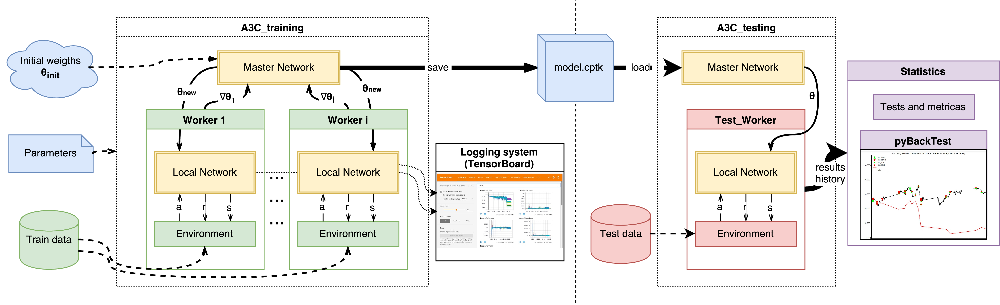

# A3C trading
*Note: Sorry for misleading naming - please use A3C_trading.py for training and test_trading.py for testing.*

Trading with recurrent actor-critic reinforcement learning - check [paper](https://arxiv.org/abs/2002.11523) and more detailed old [report](https://drive.google.com/file/d/1PK7a8pfZGrQs6WfVO-kNdgNOfvkdi5CW/view?usp=sharing)

## Configuration: `config.py`
This file contains all the pathes and gloabal variables to be set up

## Dataset: download from [GDrive](https://drive.google.com/folderview?id=0B0ozwxwZOzYLM0F0V3ljRTFfd0U&resourcekey=0-sLWkRHTSJKx_4-IHYvQslA)
After setting `config.py` please run this file to download and preprocess the data need for training and evaluation

## Environment: `trader_gym.py`
OpenAI.gym-like environment class

## Model: `A3C_class.py`
This file is containing `AC_network`, `Worker` and `Test_Worker` classes

## Training: `A3C_training.py`
Run this file, preferrable in `tmux`. During training it will create files in `tensorboard_dir` and in `model_dir`

## Testing: `A3C_testing.ipynb`
`Jupyter notebook` contains all for picturing
## Cite as: 
@article{ponomarev2019using,
  title={Using Reinforcement Learning in the Algorithmic Trading Problem},
  author={Ponomarev, ES and Oseledets, IV and Cichocki, AS},
  journal={Journal of Communications Technology and Electronics},
  volume={64},
  number={12},
  pages={1450--1457},
  year={2019},
  publisher={Springer}
}
